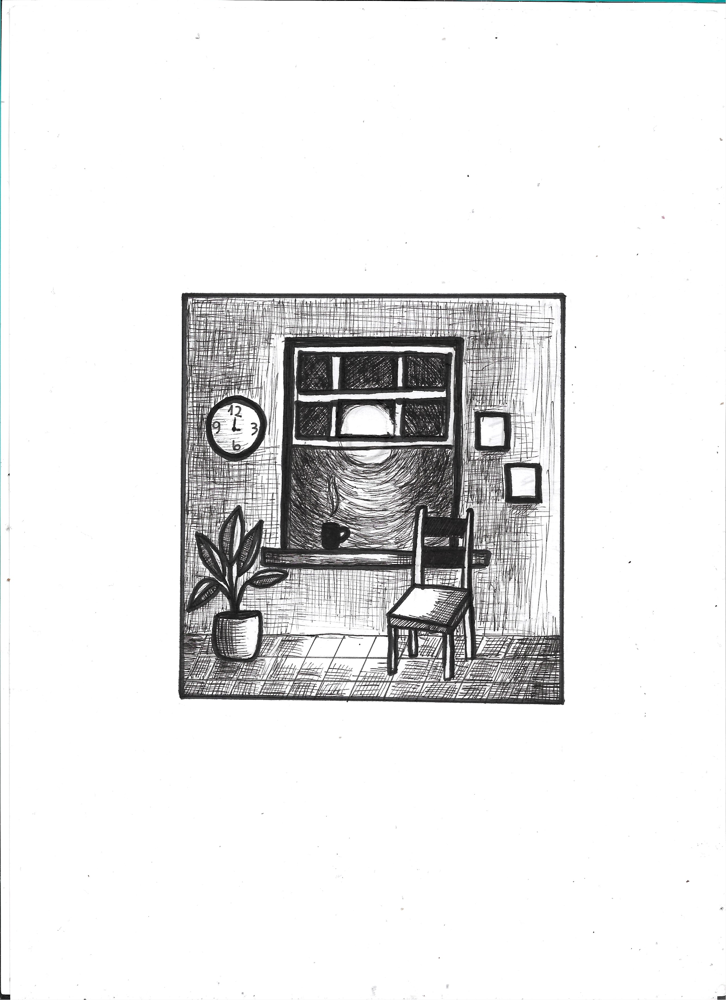

#### Acesse à música:
spotify, youtube(https://www.youtube.com/watch?v=R75M31NU1f4)

### Sobre a música:
#### Interpretação: Lucas Kauer e Erik de Oliveira
#### Letra: 

Lucas:

            ativismo também é cuidar do corpo  
            se manter saudável  
            é estudar  
            é aceitar  
            que quem não dá  
            toma.  

            vida que é  nao linear  
            segurança abstrata  
            passos que as pernas cobrem.  

            prontidão para apertar o sinto  
            quando necessário  

            e pra nao estourar o botao  
            na bonança.

            Descubro novas coisas.  
            Novas coisas das quais não quero.    
            eo  meu objetivo, nao sei dizer ao certo
            não vou saber dizer ao certo.  
            mas eh proximo da ideia
            de não te fazer chorar denovo.  
            

    Erik:
 
        "acho que pode 
        se dizer
        sorte a nossa

        em evoluir o espírito
        pode cuidar do físico

        acho que é mesmo
        sorte a nossa
        em não termos filhos
        essa flor ser lírio 
        
        em meio a tantos espinhos
        e vontades indispostas
        fiz apostas

        senti o "baque"
        quando estava sem amigos
        pro combate 
        pra rir é cedo 
        pra chorar nunca é tarde
        que triste tudo isso que te invade

        me tratando pra enxergar no céu 
        um algo lírico
        ainda bem que posso cuidar do físico"