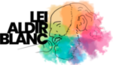

Diferente dos meus iguais, album do projeto O príncipe alegre está disponível. 

A temática central do album é relacionada ao período de chuvas no RS, no final de 2024 foi elaborado o projeto, conceito e as participações que iriam colaborar. Nesse mesmo ano o projeto foi aceito na Lei Aldir Blanc em três coroas, Rio Grande do Sul.

Os arranjos e composições são autorais, a maioria foram criados com violão de nylon em momentos de introspecção e contemplação. As letras carregam os sentimentos envolvidos e elaborados sobre as inundações. As perdas, os medos, o colapso. Com a colaboração de amigos artistas escolhidos para somar em cada construção, chegamos ao Diferente dos meus iguais.

Participações: Julia Tavares, U Juba,  Lucas Nunes, Bruno Rodrigues, Cássio Steiner, Caliel Augusto do Nascimento, Rose Bock, Lucas Gabriel Kauer

Produção: O principe alegre

Link das faixas do album disponiveis de forma aberta e gratuita. [Clique aqui ](https://drive.google.com/drive/folders/1Ou_h3L9cohrSThzasVBZmQG_dVraNBla?usp=sharing>)

<!--StartFragment-->

## Projeto contemplado edital Lei Aldir Blanc Três Coroas

<!--EndFragment-->