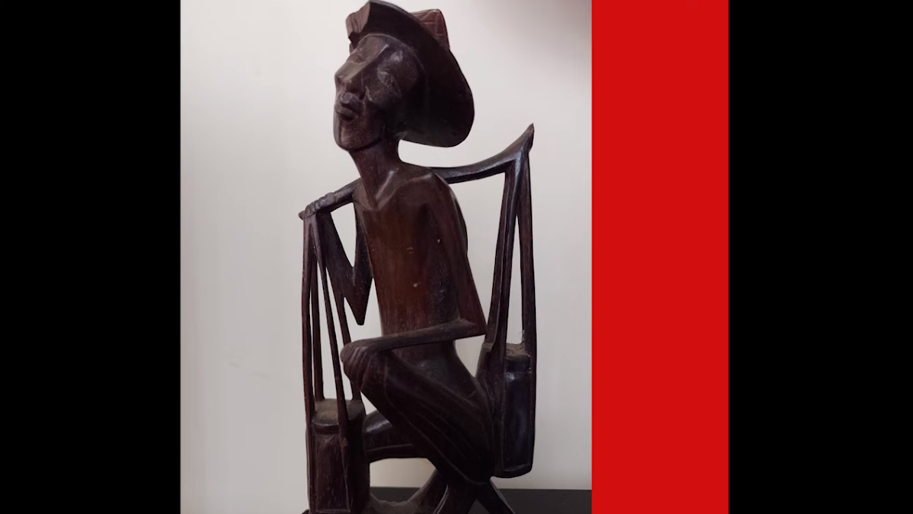

Letra: O principe Alegre

Tradução: Gidean Diniz Gallon

Voz: Gidean Diniz Gallon

Capa: O principe Alegre

Mix: Poejo

Ouvir [aqui](https://www.youtube.com/watch?v=pESK6QoZLRE)

-- Español --

En la esquina de la acera  
en el rincón de la vida  
fumando medio agazapado. 
el cuerpo obedeciendo cualquier otra cosa que no tu voluntad. 
haciendolo que se levante apesadumbradamente hacia su puesto de trabajo. 
-Hasta me levanto, pero solo salgo cuando termines ese cigarrillo 
Apuesto que este cigarro no dura ni 5 minutos 
Apuesto que nada mas dura 5 minutos 
quien dira estos 3 turnos 
 
 -- Português --
no canto da calçada 
de canto na vida 
acocadinho fumando. 
seu corpo obedecendo 
outro algo que não sua vontade. 
fazendo-o levantar vagarosamente 
em direção ao seu posto de trabalho. 
-Eu até me levanto, mas só saio  
quando terminar esse cigarro 
Eu jogo que não dura 5 minutos esse cigarro 
eu jogo que nada mais dura 5 minutos 
quem dirá esses 3 turnos