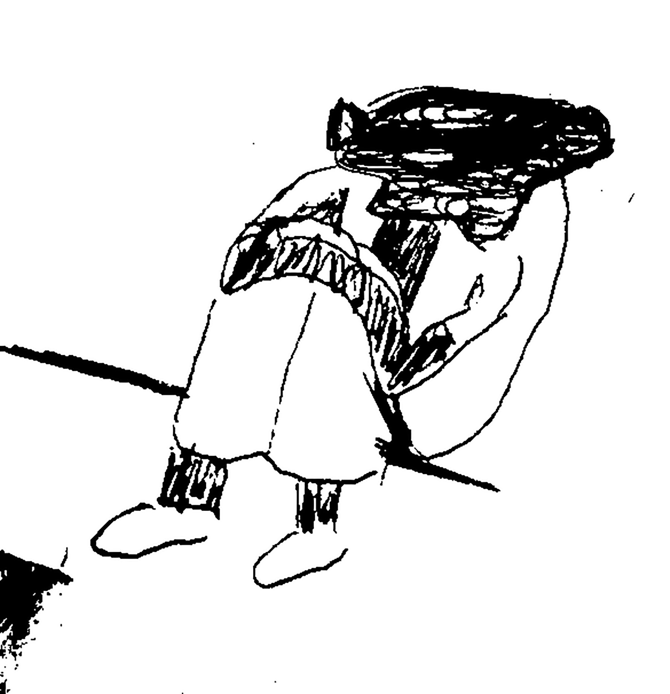

Projeto intimista com o único propósito de puxar o saco do Lipe, pois é, gente que a gente preza, tem que saber disso.

We used to play short songs é composto por três músicas:

\- Poeminha

\- A musica como forma de conciliação

\- we used to play short songs

Poeminha: Poema do Lipe, musicado por mim e recitado pela Rose.

A musica como forma de conciliação: Letra e musica minha

We used to play short songs: A mesma coisa.

A capa do projeto é um desenho autoral, mas refinado pela Rose.

As musicas estão disponiveis no youtube, bandcamp e soundcloud. Logo em breve no spotify.

As tracks das músicas estão disponíveis no drive para quem quiser reutilizar. <https://drive.google.com/drive/folders/1pV1QYXAsjGjnntjRch9PpNgBfdSVMnQf?usp=sharing>

Link para bandcamp:

https://oprincipealegre.bandcamp.com/album/we-used-to-play-short-songs